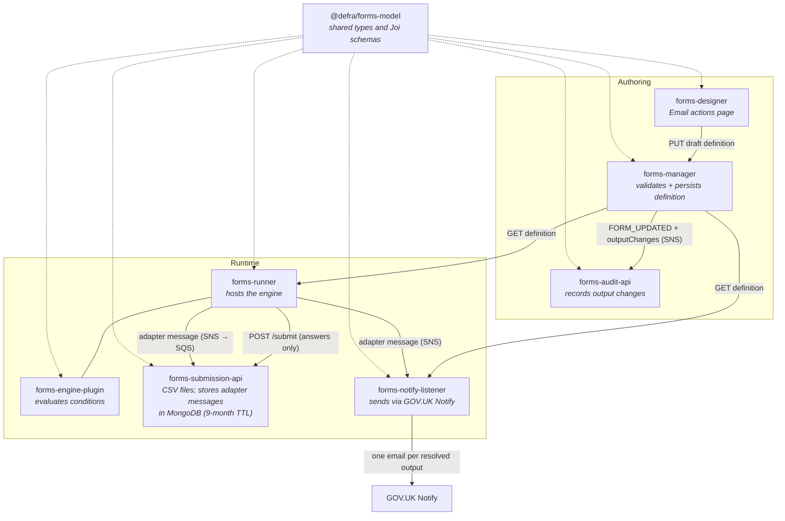
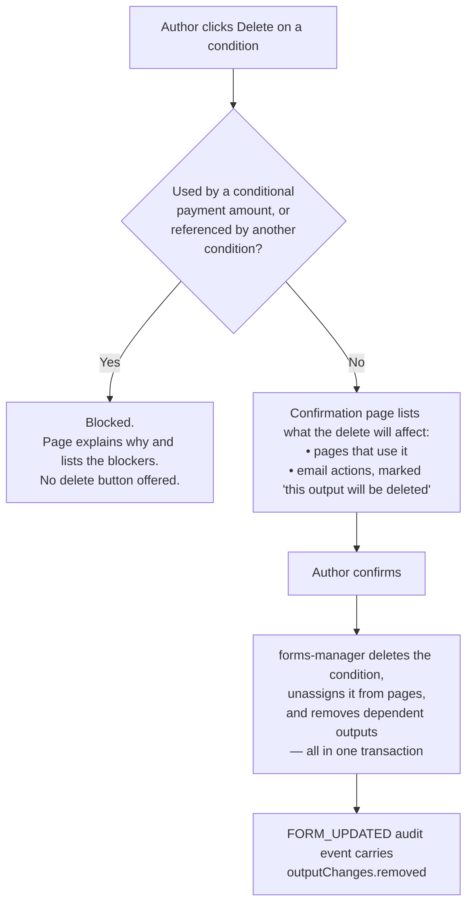
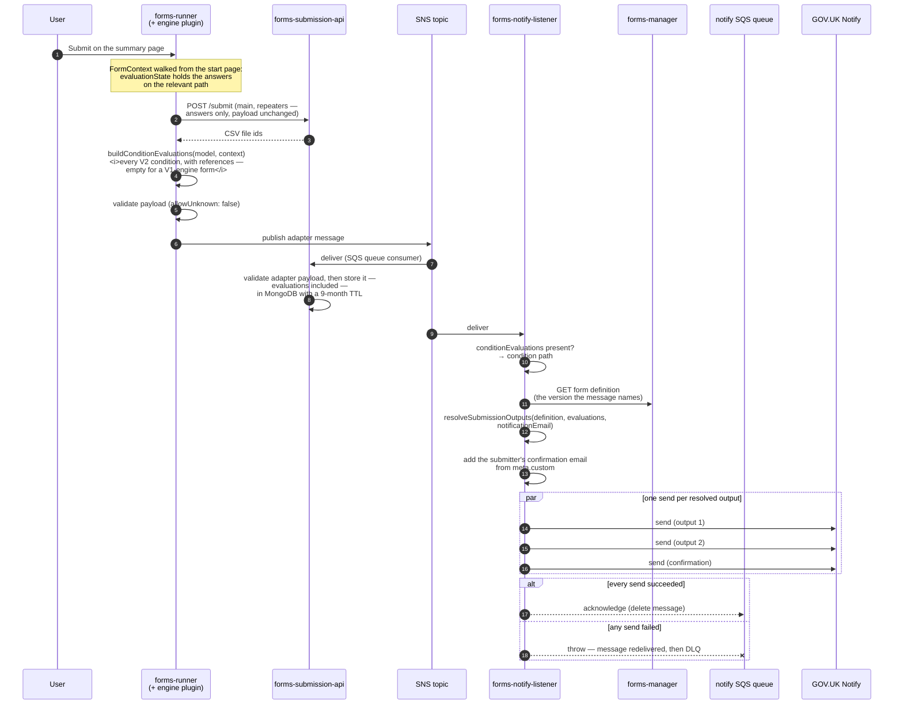
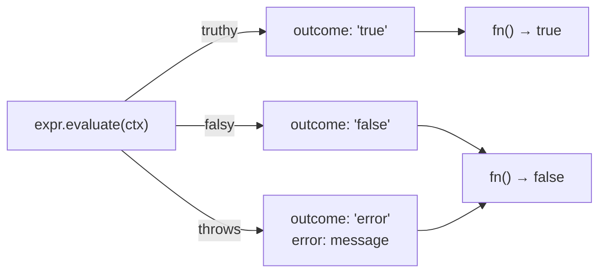
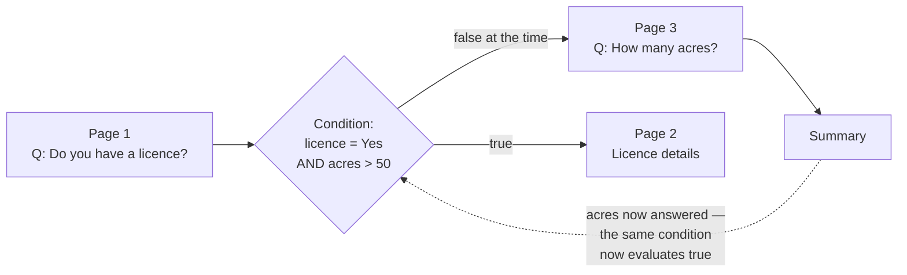
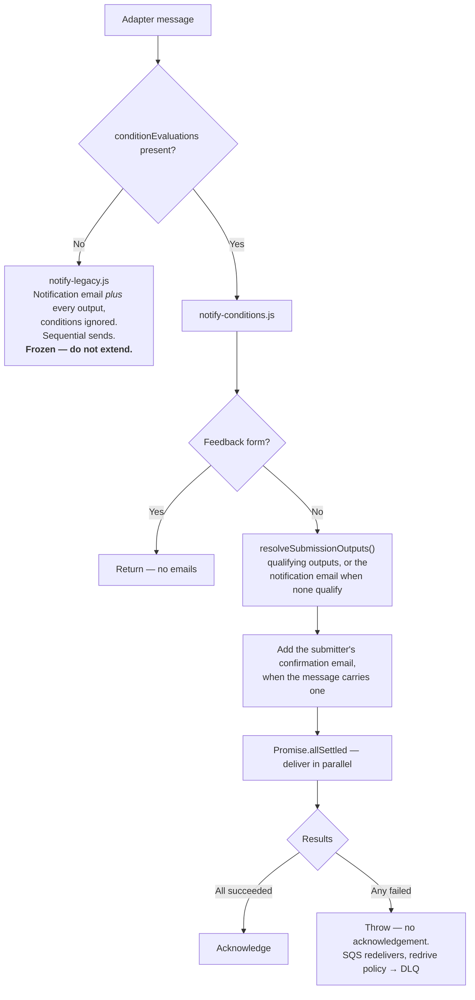

# Conditional email responses (DF-976)

Feature documentation for the conditional email work spanning `forms-designer` (including the `@defra/forms-model` workspace), `forms-manager`, `forms-engine-plugin`, `forms-runner`, `forms-submission-api`, `forms-notify-listener` and `forms-audit-api`.

---

## Contents

1. [Overview](#overview)
2. [Design rationale](#design-rationale)
3. [System components](#system-components)
4. [Authoring: email actions](#authoring-email-actions)
5. [Data model](#data-model)
6. [Runtime: submission routing](#runtime-submission-routing)
7. [Condition evaluation semantics](#condition-evaluation-semantics)
8. [Delivery and failure handling](#delivery-and-failure-handling)
9. [Auditing output changes](#auditing-output-changes)
10. [Backwards compatibility](#backwards-compatibility)

---

## Overview

Prior to this work, a form had a single submission destination: the `notificationEmail` held on the form metadata ("Submitted forms sent to"), optionally supplemented by a fixed list of additional addresses in `FormDefinition.outputs`. Every address received every submission, in the format specified by the definition.

Conditional email responses allow a form author to route submissions to an address only when a specified condition holds. A condition authored in the conditions manager — the same conditions that drive page routing — may be attached to an email address. At submission time the condition is evaluated against the answers, and the address receives the submission only if the condition passes.

The notification email is a fallback, not a guaranteed recipient. Once a form defines email actions, the qualifying addresses receive the submission in place of the metadata address; the metadata address receives the submission only when no output qualifies. The recipient list is either the qualifying outputs or the notification email, never both.

This is a behaviour change for forms that already define `outputs`, including schema V1 forms. Those addresses previously received a copy alongside the notification email, and now receive it instead of it. See [Resolving the recipients](#resolving-the-recipients).

Three changes were required:

| Change                                                 | Component             |
| ------------------------------------------------------ | --------------------- |
| An `Output` may reference a condition                  | `@defra/forms-model`  |
| Authors can create, amend and remove these outputs     | `forms-designer`      |
| Conditions are evaluated against the submitted answers | `forms-engine-plugin` |

Two further changes were made in support:

| Change                                                              | Component                                                                  |
| ------------------------------------------------------------------- | -------------------------------------------------------------------------- |
| The submission records the basis on which each address was selected | `forms-engine-plugin` → adapter message → `forms-submission-api` (MongoDB) |
| Changes to email addresses are audited individually                 | `forms-manager` → `forms-audit-api`                                        |

---

## Design rationale

Two decisions are involved: where a condition is evaluated, and where the recipient list is assembled. They are resolved differently.

### Conditions are evaluated in the engine, at submission

The engine is the only component holding the context required to evaluate a condition. `evaluationState` is derived by traversing the form from its start page along the path the respondent took, applying page conditions in sequence. A downstream consumer receives the flat set of submitted answers, not the traversal state that produced them. Reproducing that traversal in a second codebase would introduce a second implementation of the same logic, with an attendant risk of divergence.

Evaluating at submission also records the outcome as a fact about the submission, alongside the answers that produced it, rather than requiring each consumer to recompute it.

The engine therefore evaluates every V2 condition defined on the form and records the outcomes on the adapter message, in `conditionEvaluations`.

### The recipient list is assembled in the notify listener, at delivery

The alternative — the engine resolving the addresses and placing a completed recipient list on the message — was discounted.

`forms-notify-listener` already retrieves the form definition when processing a submission, since the definition is required to format the email, and the message identifies the exact version to retrieve. Given that definition and the recorded condition outcomes, determining which outputs qualify requires a small amount of logic, and the message remains a statement of fact about the submission.

---

## System components



`@defra/forms-model` is published to npm from the `model` workspace of the `forms-designer` repository; `@defra/forms-engine-plugin` is published to npm from its own repository. All other services consume them. Deployment sequencing is therefore significant — see `deployment-order.html`.

### Repository responsibilities

| Repository                       | Contribution                                                                                                                                                                                                                                                                                                                                                           |
| -------------------------------- | ---------------------------------------------------------------------------------------------------------------------------------------------------------------------------------------------------------------------------------------------------------------------------------------------------------------------------------------------------------------------- |
| **forms-designer** (`model/`)    | `Output.condition`; the supporting types `SubmitConditionEvaluation` and `SubmitConditionReference` and their Joi item schemas (reused by the engine plugin's adapter message — not part of `SubmitPayload`); `ConditionEvaluationOutcome`; `FormOutputChanges` and `getFormOutputChanges`; V1/V2 `outputs` schemas with uniqueness and condition-reference validation |
| **forms-designer** (`designer/`) | The Email actions page (list, add, change, remove, remove-all); the Advanced settings page and the Tools menu that reaches it; condition-delete warnings naming affected email actions; the conditions table showing "Email actions" as a usage                                                                                                                        |
| **forms-manager**                | Removes outputs when their condition is deleted; reads the previous draft so a whole-draft replacement can be diffed; publishes `outputChanges` on `FORM_UPDATED`; switches definition validation from `alternatives().try()` to `alternatives().conditional()` on `schema`                                                                                            |
| **forms-engine-plugin**          | `ExecutableCondition.evaluate()` (distinguishes error from false); `buildConditionEvaluations()`; `conditionEvaluations` on the adapter message payload and its schema. The adapter formatter and its schema version are otherwise unchanged                                                                                                                           |
| **forms-runner**                 | No change beyond the dependency bumps; it publishes with the same adapter formatter as before                                                                                                                                                                                                                                                                          |
| **forms-submission-api**         | Stores each adapter message, including `conditionEvaluations`, in the MongoDB `submissions` collection with a 9-month TTL, via its queue consumer. Requires the engine plugin bump so its copy of the adapter schema retains the new field rather than stripping it; the `/submit` endpoint is unchanged                                                               |
| **forms-notify-listener**        | Resolves the recipients from the form definition and the recorded condition outcomes, sends to each in parallel, and fails the whole submission if any send fails; a frozen legacy path handles messages carrying no outcomes                                                                                                                                          |
| **forms-audit-api**              | Persists `outputChanges` on `FORM_UPDATED` audit records, via the model bump only                                                                                                                                                                                                                                                                                      |

---

## Authoring: email actions

### Navigation

The editor's pages screen previously presented a row of secondary buttons (Manage conditions, Upload, Download, Welsh translation). These are now grouped under a Tools menu, which also contains a new Advanced settings page. Advanced settings is a table of form-level settings; it currently holds one row, Email actions.

```
Editor → Pages → Tools ▾ → Advanced settings → Email actions
```

### The email actions page

The page comprises three parts:

1. **Default email address** — a summary card showing the form's `notificationEmail` and the format it is sent in (from `definition.output`). The card is read-only; "Change" links to the existing notification email settings. A warning on the card states the rule: the address "receives all submissions until you add another email address. After that, it only receives submissions that do not match any additional email address conditions." The card also states the remedy — to continue receiving all submissions, add the same address as an additional address without a condition — and links to the add form.
2. **Additional email addresses** — a table of `definition.outputs`, one row per output, showing the address, the circumstances under which submissions are sent (the condition's display name, or "Every submission (no condition)"), the format, and Change/Remove actions. A trailing row provides Remove all.
3. **Add / change form** — a condition select, an email address input, and a human/machine format radio. Selecting machine-readable reveals a further set of radios for the format version.

A "How additional email addresses work" details section sits between the card and the table, covering the remainder of the rule: an additional address receives a submission meeting its condition, a submission matching several conditions is sent to each corresponding address, and a submission matching none is sent to the default address.

Constraints enforced in the designer:

- Maximum of 20 additional addresses (`MAX_ADDITIONAL_EMAILS`). The add form is hidden at the limit; existing entries remain editable.
- Human-readable output is always sent as the latest version; only machine-readable offers a version choice (`v2` latest, `v1` legacy).
- Addresses are lower-cased on save.
- Duplicates are rejected — see [Uniqueness](#uniqueness).
- Only V2 conditions are offered. The condition select is populated from `definition.conditions` filtered by `isConditionWrapperV2`, sorted by display name.

### Deleting a condition used by an email action

An email action exists solely to send submissions in a particular circumstance. If the condition is deleted, the action has no meaning and is deleted with it. This differs from a page, which loses its condition and continues to be shown.

The condition-delete confirmation page was reworked to make this explicit:



The conditions list page also shows "Email actions" on its own line in the "Used in" column, beneath any page numbers, so that an author can see that a condition drives delivery as well as routing.

---

## Data model

### `Output` gains a condition

```ts
interface Output {
  audience: OutputAudience   // 'human' | 'machine'
  version: string            // '1' | '2'
  emailAddress: string
  condition?: string         // V2 only — rejected by the V1 schema
}
```

`condition` holds a V2 condition id. The V2 definition schema validates that the id exists in the sibling `conditions` array (`FormDefinitionError.RefOutputCondition`); the V1 schema rejects the property outright.

### Uniqueness

Two outputs are duplicates when they would send the same format of the same submission to the same inbox in the same circumstances. The key is a composite:

```
emailAddress (trimmed, lower-cased) | condition (trimmed) | audience | version
```

`getOutputKey` and `isDuplicateOutput` in the model implement this, and the Joi array applies `.unique(isDuplicateOutput)`. The same address may therefore appear more than once legitimately — for example, once as human-readable and once as machine-readable, or once unconditionally and once behind a condition.

Because the uniqueness constraint is a composite, there is no single Joi `key` against which to map errors. `formDefinitionErrors[UniqueOutput].key` is the empty string, and `checkErrors` was extended to treat an empty key as matching any unique constraint on the schema.

### The `/submit` payload is unchanged

`SubmitPayload`, posted by the engine to `forms-submission-api`, does not carry the new data. That endpoint produces the CSV files only. The evaluated data is carried on the adapter message (next section), which is the artefact that is both delivered and stored.

The model retains ownership of the supporting types, because the adapter message reuses them:

```ts
interface SubmitConditionEvaluation {
  conditionId: string
  outcome: 'true' | 'false' | 'error'      // ConditionEvaluationOutcome
  references: SubmitConditionReference[]
}

interface SubmitConditionReference {
  componentId: string
  componentName: string
  answered: boolean
}
```

These reside in `@defra/forms-model` alongside matching Joi item schemas (`formSubmitConditionEvaluationSchema`, `formSubmitConditionReferenceSchema`), which the engine plugin composes into its adapter payload schema.

### The adapter message carries the condition outcomes

The payload gains one field:

```ts
conditionEvaluations?: SubmitConditionEvaluation[]
```

The field is always emitted going forwards, as an empty array when there is nothing to report, since a V1-engine form has no stable condition ids to record against. It is optional purely for backwards compatibility: a message published before the field existed carries none at all, and that absence is the only reliable marker of such a message.

`FormAdapterSubmissionSchemaVersion` remains at `V1 = 1`. No change to the message requires an existing consumer to adapt, so no new version is introduced: a consumer validating with `stripUnknown` and an older schema drops the field and continues to operate. This keeps `forms-sharepoint-listener`, `forms-newls-cwt-listener` and services built from `forms-adaptor-template` out of the deployment sequence entirely.

Two consumers read the field:

- `forms-notify-listener` resolves the recipients from it — see [Resolving the recipients](#resolving-the-recipients).
- `forms-submission-api` stores it, so that the submission record retains the basis on which the submission was routed.

---

## Runtime: submission routing



### Storing the submission record

`forms-submission-api` consumes the same SNS topic, via SQS, that delivers the message to `forms-notify-listener`. Its consumer validates the message against the adapter payload schema — with `stripUnknown: true`, so a field must be present in the schema to survive — and stores the parsed result verbatim in the MongoDB `submissions` collection, stamped with `recordCreatedAt` and an `expireAt` nine months later. A TTL index on `expireAt` removes the record after that period.

The stored record therefore holds the outcome of every V2 condition at the point of submission. The record does not name the addresses the submission was sent to, but it holds everything required to derive them, because `meta` names the exact definition version those outcomes were evaluated against.

### Resolving the recipients

`forms-notify-listener` performs this in `notify-conditions.js`, as `resolveSubmissionOutputs(definition, conditionEvaluations, notificationEmail, formId)`.

The definition it resolves against is the one the message names — `meta.status` and `meta.versionMetadata.versionNumber` — not the current draft or live definition. An edit made after submission cannot retrospectively change where that submission is sent.

Conditions are not re-evaluated at this point. The outcome of each is read from `conditionEvaluations`, keyed by condition id. The listener holds no evaluation context, and constructing one there is out of scope; see [Design rationale](#design-rationale).

The list is built in two steps:

1. **Every output whose condition qualifies.** An output with no condition always qualifies. An output whose condition evaluated `false` or `error` does not. An output naming a condition with no recorded outcome also does not qualify, and the exclusion is logged as an error. The message and the definition are pinned to the same version, so this indicates that the engine did not evaluate a condition the definition names: the output references a condition id that does not resolve, the condition is not a V2 condition wrapper, or the submission originated from a V1-engine form, which reports no outcomes. In each case the gate the author placed on that address cannot be shown to have passed, so sending regardless would disclose the submission to a recipient intended to be filtered out.
2. **The form's notification email, and only if step 1 produced no recipients.** Sent in the format given by `definition.output`, or `human`/`2` if the definition has no `output` block.

The notification email is a fallback, not a base to which outputs are added. Adding a single email action stops the metadata address receiving that form's submissions; it receives the submission again as soon as no output qualifies, so a submission is never dropped for want of a recipient.

To restore the previous behaviour, an author adds the notification address as an unconditional output. It then qualifies on every submission in its own right and the fallback never fires. The email actions page states this remedy.

The delivery path cannot distinguish a form with no outputs from a form whose outputs all failed their conditions; both resolve to the notification email alone. The `conditionEvaluations` on the stored record distinguish the two after the fact. The same applies to a fail-closed exclusion: an output dropped for an unrecorded condition leaves no trace, so a form whose only output was excluded falls back rather than resolving to no recipient.

Outputs are deduplicated on `emailAddress|audience|version`, with the address compared case-insensitively, retaining the first casing encountered. The definition schema already rejects two outputs matching on all four parts of the [uniqueness key](#uniqueness), so runtime deduplication is required only for the case the schema cannot detect: a conditional output resolving to an address an unconditional output already covers. The same address may still legitimately receive both the human-readable and the machine-processable output; those are two distinct sends, and both are made.

### The format the fallback is sent in

This is a narrower fallback, easily confused with the one above. It determines only the audience and version in which the notification email is sent when the definition has no `output` block. An output always carries its own audience and version, so it never requires this fallback.

The value is `human`/`2`, which `forms-notify-listener` has always applied in its legacy path (`sendNotifyEmailsLegacy`). Both paths now reside in the same service, so the constant sits alongside them with a cross-reference; a differing default on either side would silently change the template used for every form with no explicit `output`.

### Feedback forms and the notification email override

`forms-runner` overrides `meta.notificationEmail` for feedback forms, directing the submission to the related form's inbox rather than the feedback form's own.

No further handling is required. The recipients are resolved from `meta.notificationEmail` at delivery time, so the override is simply the address to which the fallback resolves; there is no separately-resolved list on the message that could disagree with it. `forms-notify-listener` sends no emails for feedback forms on either path, so in practice this affects only the contents of the stored record.

---

## Condition evaluation semantics

### Every V2 condition is recorded, not only those used for email

`buildConditionEvaluations` walks `model.def.conditions`, filters to V2 conditions, and evaluates each against `context.evaluationState`. This includes conditions used only for page routing, only for conditional payment amounts, or not used at all.

V1 conditions are not recorded. V1 condition ids are not stable, and V1 conditions reference components by name rather than by id; V1 components need not have an id at all.

### `evaluationState` is a snapshot of the final relevant path

Before the page walk, `FormModel.initialiseContext` seeds `evaluationState` with every non-repeater component set to `null`, because the condition evaluation library throws on an undefined key. The walk then overwrites those seeds with real answers, page by page, along the relevant path from the start page to the summary page.

There are two consequences:

- **A question the user never reached is `null`, not absent.** Conditions still return a boolean for it. Negative operators — "is not", "is shorter than" — return `true` against `null`. An outcome of `true` is therefore not evidence that the user provided that answer. This is why each evaluation records its `references` with an `answered` flag: without it, a consumer cannot distinguish a genuine match from a vacuous one.
- **Components on repeater pages are excluded from `evaluationState` entirely.** A condition referencing one throws, and is recorded with outcome `error`.

### `error` is deliberately distinct from `false`

`FormModel.makeCondition` previously exposed a single `fn` that swallowed evaluation errors and returned `false`. It now also exposes `evaluate()`, which returns `{ outcome, error? }`:



The behaviour of `fn` is unchanged: routing and component visibility continue to treat a failed evaluation as `false`. `evaluate` exists so that the audit record can distinguish the two cases, which are not equivalent for audit purposes.

### Limitations of the recorded conditions

The recorded outcomes represent the state at submission, not a trace of the journey through the form.

A condition is evaluated many times while a user completes a form — once each time the engine determines the next page. The value recorded at submission is a single, final evaluation against the answers as they stood at the end.

The two can legitimately disagree. The clearest case is:



When the routing decision was made, "How many acres?" had not been asked, so it was `null` and the condition was `false`; the user was correctly routed past page 2. By the time they reach the summary they have answered it, and the same condition evaluates `true`. The submission records `true`.

The two also diverge when:

- The user navigates back and changes an earlier answer after a branch has been taken.
- A branch the user entered is subsequently left, and its answers are no longer on the relevant path, reverting to the seeded `null` at submission.

---

## Delivery and failure handling

`forms-notify-listener` dispatches on whether the message records how the form's conditions stood:



The gate is the presence of the property, not the message's schema version. The version conveys nothing about it: every message published since this work carries the property — empty when the form has no V2 conditions to report — and no message published before it does.

### The confirmation email

The "we've received your form" email to the submitter is not an output on the form definition. `forms-runner` attaches the submitter's address to `meta.custom.userConfirmationEmail` after the engine has formatted the message, so the engine never observes it and the definition has no bearing on it.

The listener adds it to the sends it makes, alongside the resolved outputs. It has its own template and formatter, so it requires no audience or version.

### Failure handling

| Situation                  | Behaviour                                                                                                                                                                                          |
| -------------------------- | -------------------------------------------------------------------------------------------------------------------------------------------------------------------------------------------------- |
| Every address delivers     | Message acknowledged                                                                                                                                                                               |
| Any address fails          | Throws. The message is not acknowledged, SQS redelivers it, and the redrive policy eventually moves it to the DLQ. Logged as `[emailSendFailed]` with counts, never addresses                      |
| A redelivered submission   | Sent to every resolved address again, including any that previously succeeded. No partial progress is recorded, so duplicate email is accepted in exchange for never silently dropping a recipient |
| A Notify error of any kind | Not retried within a pass. The message failing and being redelivered constitutes the retry; there is no per-address retry, back-off or requeue                                                     |
| A hung Notify request      | Cut off after `NOTIFY_REQUEST_TIMEOUT_MS`, and treated as a failure like any other. Without it, a hung request would hold the submission until the SQS visibility timeout expired                  |

Per-address delivery state previously resided on the message: a partial failure republished the target list with the delivered entries flagged, so a second pass sent only the outstanding entries. This was removed along with the target list itself. The resulting contract is simpler — the submission either reached every intended recipient or it failed — at the cost of duplicate emails on a partial failure.

### Configuration

| Variable                    | Default | Controls                                                                                                                              |
| --------------------------- | ------- | ------------------------------------------------------------------------------------------------------------------------------------- |
| `NOTIFY_REQUEST_TIMEOUT_MS` | 5000    | Per-request timeout against GOV.UK Notify. Previously unbounded; a hung request held the message until the visibility timeout expired |

---

## Auditing output changes

A `REPLACE_DRAFT` audit event carries the whole definition to S3 and places only a pointer on the message. This is sufficient for most edits, but an audit of which recipients receive a form's submissions warrants more than a pointer to a JSON file, so output changes are extracted and placed on the event itself.

`FormUpdatedMessageData` gains:

```ts
outputChanges?: {
  added?: Output[]
  updated?: { previous: Output, new: Output }[]
  removed?: Output[]
}
```

Empty collections are omitted, and the object as a whole is absent when an update did not affect the outputs.

### Determining what changed

Outputs carry no id, so an amendment cannot be detected directly. `getFormOutputChanges` pairs entries positionally: an entry that disappears from a position while another appears at the same position is reported as an `updated` pair rather than as an unrelated removal and addition. This matches the editor's behaviour when an author changes an existing email action. Any remaining entries are reported as a plain addition or removal, so a wholesale replacement — a JSON upload, for example — is still recorded.

Comparison here is exact. Unlike the duplicate check, a change of case in an address is recorded as a change.

### Sources of the changes

| Trigger                                                                      | Path                                                                                                                                                                |
| ---------------------------------------------------------------------------- | ------------------------------------------------------------------------------------------------------------------------------------------------------------------- |
| Any draft definition update (add/change/remove an email action, JSON upload) | `updateDraftFormDefinition` reads the previous draft before overwriting, then `publishFormDraftReplacedEvent` diffs the two with `getFormOutputChanges`             |
| Deleting a condition                                                         | `deleteCondition` returns the outputs it removed, and `removeConditionOnDraftFormDefinition` places them on the `DELETE_CONDITION` event as `outputChanges.removed` |

Recording the removal against `DELETE_CONDITION`, rather than leaving it to be inferred from a neighbouring `REPLACE_DRAFT`, attributes the removal to the action that caused it.

`forms-audit-api` requires no code change: it validates against the model's `messageSchema` and persists the result. It does require the model bump, because it validates with `stripUnknown: true`; an audit API on an older model would silently drop `outputChanges` and store an incomplete record without error.

---

## Backwards compatibility

| Concern                                    | Handling                                                                                                                                                                                                                                                                                                                         |
| ------------------------------------------ | -------------------------------------------------------------------------------------------------------------------------------------------------------------------------------------------------------------------------------------------------------------------------------------------------------------------------------- |
| Runners that predate this work             | They publish messages carrying no `conditionEvaluations`, which route to the frozen legacy path. `SubmitPayload` is unchanged, so `/submit` requires no compatibility handling                                                                                                                                                   |
| Adapter messages already on a queue or DLQ | `conditionEvaluations` is optional, so an older message still validates. Its absence routes the message to the legacy path                                                                                                                                                                                                       |
| The legacy notify path                     | `notify-legacy.js` is deliberately unchanged, including its sequential sends, so in-flight messages behave exactly as before. This includes building the list as the notification email plus every output, with conditions ignored, so the two paths route differently by design while a queue drains or after a runner rollback |
| V1 form definitions                        | `Output.condition` is rejected by the V1 schema. `buildConditionEvaluations` returns an empty list for a V1 engine — emitted rather than omitted, so the message still routes to the condition path. V1 outputs have no condition, so all of them qualify                                                                        |
| Forms that already define `outputs`        | **Migration required.** Those addresses now receive the submission instead of the notification email rather than alongside it. This applies to V1 and V2 alike, and to forms that have not been edited. Forms with no `outputs` are unaffected; forms with them require their notification email adding to the outputs           |
| Forms with no `output` block               | Both notify paths fall back to `human`/`2`, as the legacy path has always done                                                                                                                                                                                                                                                   |
| Other adapter consumers                    | `forms-sharepoint-listener`, `forms-newls-cwt-listener` and `forms-adaptor-template` validate the same payload schema with `stripUnknown` and require no change: the schema version is unchanged, and an older schema simply drops `conditionEvaluations`. They require a bump only if they come to read it                      |
