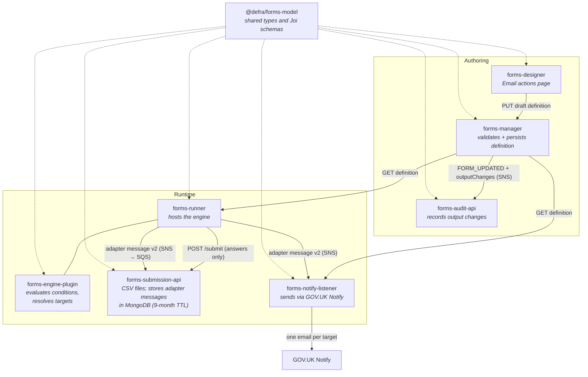
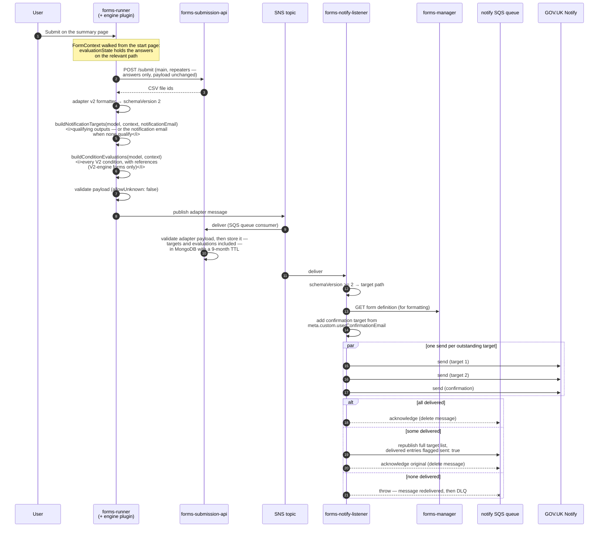
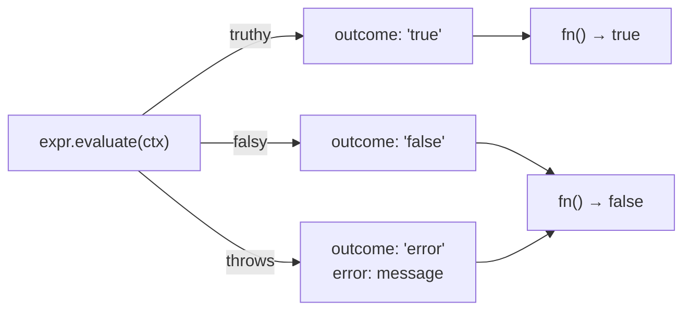
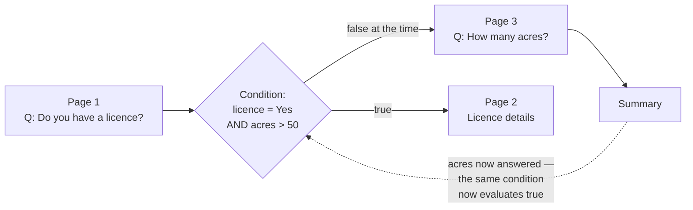
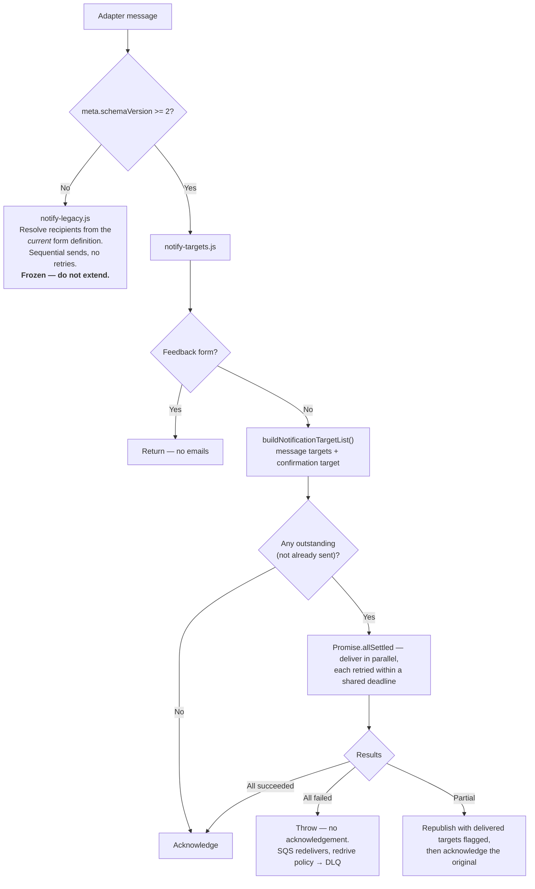

# Conditional email responses (DF-976)

Feature documentation for the conditional email work spanning `forms-designer` (including the `@defra/forms-model` workspace), `forms-manager`, `forms-engine-plugin`, `forms-runner`, `forms-submission-api`, `forms-notify-listener` and `forms-audit-api`.

---

## Contents

1. [What the feature does](#what-the-feature-does)
2. [Why it was built this way](#why-it-was-built-this-way)
3. [The moving parts](#the-moving-parts)
4. [Authoring: email actions in the designer](#authoring-email-actions-in-the-designer)
5. [The data model](#the-data-model)
6. [Runtime: how a submission is routed](#runtime-how-a-submission-is-routed)
7. [Condition evaluation semantics](#condition-evaluation-semantics)
8. [Delivery, retries and requeueing](#delivery-retries-and-requeueing)
9. [Auditing changes to email actions](#auditing-changes-to-email-actions)
10. [Backwards compatibility](#backwards-compatibility)
11. [Known gaps](#known-gaps)

---

## What the feature does

Before this work a form had exactly one place its submissions could go: the `notificationEmail` held on the form metadata ("Submitted forms sent to"), optionally supplemented by a fixed list of extra addresses in `FormDefinition.outputs`. Every address received every submission, in whatever format the definition specified.

Conditional email responses let a form author say **"send submissions to this address only when this condition is true"**. A condition already authored in the conditions manager — the same conditions that drive page routing — can now be attached to an email address. At submission time the condition is evaluated against the answers, and the address receives the submission only if it passes.

**The notification email is a fallback, not a guaranteed recipient.** Once a form has email actions, the addresses that qualify take the submission over entirely — the metadata address receives it only when nothing else does. The recipient list is _either_ the qualifying outputs _or_ the notification email, never both.

That is a live behaviour change for forms that already carry `outputs`, including schema V1 forms: those addresses used to receive a copy _alongside_ the notification email, and now they receive it _instead of_ it. See [Resolving the target list](#resolving-the-target-list).

Three things had to change to make that work:

| Change                                                             | Where                 |
| ------------------------------------------------------------------ | --------------------- |
| An `Output` can name a condition                                   | `@defra/forms-model`  |
| An author can create, amend and remove these outputs               | `forms-designer`      |
| Something has to evaluate the condition against the actual answers | `forms-engine-plugin` |

And two things were added in support of these changes:

| Change                                                 | Where                                                                      |
| ------------------------------------------------------ | -------------------------------------------------------------------------- |
| The submission records **why** each address was chosen | `forms-engine-plugin` → adapter message → `forms-submission-api` (MongoDB) |
| Changes to email addresses are audited individually    | `forms-manager` → `forms-audit-api`                                        |

---

## Why it was built this way

The central decision is **where the condition gets evaluated**. There were two credible options:

**Option A — evaluate downstream at delivery time.** `forms-notify-listener` already fetches the form definition when it processes a submission, so it could read `outputs`, evaluate each condition against the submitted answers, and decide who to email.

**Option B — evaluate at the point of submission, in the engine, and put the answer in the message.**

Option B was chosen, for two reasons:

1. **Only the engine has the evaluation context.** `evaluationState` is built by walking the form from its start page along the relevant path, applying page conditions as it goes. The notify listener has the flat submitted answers, not the walked context, and reimplementing the walk in a second codebase would allow the two implementations to diverge.
2. **There is more than one consumer.** The adapter message is published to a general SNS topic _and_ optionally to a per-form topic consumed by `forms-sharepoint-listener`, `forms-newls-cwt-listener` and services built from `forms-adaptor-template`. Resolving recipients once, upstream, means every consumer agrees on who should have received what.

The consequence of Option B is that the message required an additional field, which in turn required a **new adapter schema version (V2)**.

---

## The moving parts



`@defra/forms-model` is published to npm from the `model` workspace of the `forms-designer` repo; `@defra/forms-engine-plugin` is published to npm from its own repository. Everything else consumes them. This is why the deployment sequencing matters so much — see `deployment-order.html`.

### Repository responsibilities

| Repository                       | What it contributes                                                                                                                                                                                                                                                                                                                                                                                 |
| -------------------------------- | --------------------------------------------------------------------------------------------------------------------------------------------------------------------------------------------------------------------------------------------------------------------------------------------------------------------------------------------------------------------------------------------------- |
| **forms-designer** (`model/`)    | `Output.condition`; the supporting types `SubmitConditionEvaluation`, `SubmitConditionReference`, `SubmitNotificationTarget` and their Joi item schemas (reused by the engine plugin's adapter message — **not** part of `SubmitPayload`); `ConditionEvaluationOutcome`; `FormOutputChanges` and `getFormOutputChanges`; V1/V2 `outputs` schemas with uniqueness and condition-reference validation |
| **forms-designer** (`designer/`) | The **Email actions** page (list, add, change, remove, remove-all); the new **Advanced settings** page and the **Tools** menu that reaches it; condition-delete warnings that name affected email actions; the conditions table showing "Email actions" as a usage                                                                                                                                  |
| **forms-manager**                | Removes outputs when their condition is deleted; reads the previous draft so a whole-draft replacement can be diffed; publishes `outputChanges` on `FORM_UPDATED`; switches definition validation from `alternatives().try()` to `alternatives().conditional()` on `schema`                                                                                                                         |
| **forms-engine-plugin**          | `ExecutableCondition.evaluate()` (distinguishes error from false); `buildConditionEvaluations()`; `buildNotificationTargets()`; adapter output formatter **v2** and `FormAdapterSubmissionSchemaVersion.V2`; `FormAdapterNotificationTarget` and its schema; `notificationTargets` and `conditionEvaluations` on the adapter message payload                                                        |
| **forms-runner**                 | Publishes with the **adapter v2** formatter; repoints notification targets when a feedback form overrides the notification email                                                                                                                                                                                                                                                                    |
| **forms-submission-api**         | Stores each adapter message — including `notificationTargets` and `conditionEvaluations` — in the MongoDB `submissions` collection with a 9-month TTL, via its queue consumer. Needs the **engine plugin** bump so its copy of the adapter schema validates V2 messages; the `/submit` endpoint is unchanged                                                                                        |
| **forms-notify-listener**        | Sends per resolved target, in parallel, with retries, partial-failure requeue and a frozen legacy path for pre-V2 messages                                                                                                                                                                                                                                                                          |
| **forms-audit-api**              | Persists `outputChanges` on `FORM_UPDATED` audit records — via the model bump only                                                                                                                                                                                                                                                                                                                  |

---

## Authoring: email actions in the designer

### Navigation

The editor's pages screen previously had a row of secondary buttons (Manage conditions, Upload, Download, Welsh translation). Those are now behind a **Tools** menu, which also contains a new **Advanced settings** page. Advanced settings is a table of form-level settings; today it has one row, **Email actions**.

```
Editor → Pages → Tools ▾ → Advanced settings → Email actions
```

### The email actions page

The page has three parts:

1. **Default email address** — a summary card showing the form's `notificationEmail` and the format it is sent in (from `definition.output`). It is read-only here; "Change" links to the existing notification email settings. A warning on the card states the rule: the address "receives all submissions until you add another email address. After that, it only receives submissions that do not match any additional email address conditions." It also gives the author the way back — to carry on receiving everything, add the same address as an _additional_ address, unconditionally — and links straight to the add form.
2. **Additional email addresses** — a table of `definition.outputs`, one row per output, showing the address, _when_ submissions are sent (the condition's display name, or "Every submission (no condition)"), the format, and Change/Remove actions. A trailing row carries **Remove all**.
3. **Add / change form** — a condition select, an email address input, and a human/machine format radio. Choosing machine-readable reveals a second set of radios for the format version.

A **How additional email addresses work** details section sits between the card and the table, covering the rest of the rule: an additional address receives a submission that meets its condition, a submission matching several conditions goes to each of those addresses, and a submission matching none goes to the default address.

Constraints enforced in the designer:

- **Maximum 20 additional addresses** (`MAX_ADDITIONAL_EMAILS`). The add form is hidden at the limit; an existing entry can still be amended.
- **Human-readable is always sent as the latest version** — only machine-readable offers a version choice (`v2` latest, `v1` legacy).
- **Addresses are lower-cased** on save.
- **Duplicates are rejected** — see [uniqueness](#uniqueness) below.
- Only **V2 conditions** are offered. The condition select is populated from `definition.conditions` filtered by `isConditionWrapperV2`, sorted by display name.

### Deleting a condition that an email action uses

An email action exists _only_ to send submissions in a particular circumstance. If the condition goes, the action has no meaning, so it goes too. This is different from a page, which simply loses its condition and carries on being shown.

The condition-delete confirmation page was reworked to make this explicit:


The conditions list page also now shows **"Email actions"** on its own line in the "Used in" column, beneath any page numbers, so an author can see at a glance that a condition drives delivery as well as routing.

---

## The data model

### `Output` gains a condition

```ts
interface Output {
  audience: OutputAudience   // 'human' | 'machine'
  version: string            // '1' | '2'
  emailAddress: string
  condition?: string         // V2 only — rejected by the V1 schema
}
```

`condition` holds a **V2 condition id**. The V2 definition schema validates that the id exists in the sibling `conditions` array (`FormDefinitionError.RefOutputCondition`); the V1 schema rejects the property outright.

### Uniqueness

Two outputs are duplicates when they would send _the same format of the same submission to the same inbox in the same circumstances_. The key is a composite:

```
emailAddress (trimmed, lower-cased) | condition (trimmed) | audience | version
```

`getOutputKey` / `isDuplicateOutput` in the model implement this, and the Joi array uses `.unique(isDuplicateOutput)`. The same address may therefore appear more than once legitimately — for example, once as human-readable and once as machine-readable, or once unconditionally and once behind a condition.

Because the uniqueness constraint is a composite, there is no single Joi `key` to map errors against. `formDefinitionErrors[UniqueOutput].key` is the empty string, and `checkErrors` was extended to treat an empty key as "matches any unique constraint on this schema".

### The `/submit` payload is unchanged

`SubmitPayload` (posted by the engine to `forms-submission-api`) does **not** carry the new data. That endpoint produces the CSV files and nothing else. The evaluated data is carried on the **adapter message** (next section), which is the artefact that is both delivered and stored.

The model still owns the supporting types, because the adapter message reuses them:

```ts
interface SubmitConditionEvaluation {
  conditionId: string
  outcome: 'true' | 'false' | 'error'      // ConditionEvaluationOutcome
  references: SubmitConditionReference[]
}

interface SubmitConditionReference {
  componentId: string
  componentName: string
  answered: boolean
}

interface SubmitNotificationTarget {
  emailAddress: string
  audience: OutputAudience
  version: string
}
```

These live in `@defra/forms-model` alongside matching Joi item schemas (`formSubmitConditionEvaluationSchema`, `formSubmitNotificationTargetSchema`), which the engine plugin composes into its adapter payload schema.

### The adapter message gains a schema version — and both fields

`FormAdapterSubmissionSchemaVersion` gains `V2 = 2`. The payload gains:

```ts
notificationTargets?: FormAdapterNotificationTarget[]
conditionEvaluations?: SubmitConditionEvaluation[]
```

`notificationTargets` is **required when `meta.schemaVersion` is 2** and **forbidden when it is 1** — enforced by a Joi `when` on `meta.schemaVersion`.

`conditionEvaluations` is **optional on V2** and forbidden on V1. It is optional even on V2 because only V2 _engine_ forms have stable condition ids to report against — a V2 message can legitimately carry a V1-engine form, and then there is nothing to record. It exists so the stored submission record says why the submission went where it did; delivery consumers do not read it.

`FormAdapterNotificationTarget` extends the model's immutable `SubmitNotificationTarget` with mutable delivery bookkeeping owned by the consumer:

```ts
interface FormAdapterNotificationTarget extends SubmitNotificationTarget {
  type?: 'submission' | 'confirmation'   // absent means 'submission'
  sent?: boolean
  sendAttempts?: number
}
```

The engine never emits `type`, `sent` or `sendAttempts`. They exist so a consumer republishing a partially-delivered message can record what already got through.

---

## Runtime: how a submission is routed



### Storing the submission record

`forms-submission-api` consumes the same SNS topic (via SQS) that delivers the message to `forms-notify-listener`. Its consumer validates the message against the adapter payload schema — with `stripUnknown: true`, so a field must be in the schema to survive — and stores the parsed result verbatim in the MongoDB `submissions` collection, stamped with `recordCreatedAt` and an `expireAt` nine months later. A TTL index on `expireAt` removes the record after that period.

Because `notificationTargets` and `conditionEvaluations` are on the adapter schema, the stored record holds both: **who** the submission was sent to and **why** — the outcome of every V2 condition at the point of submission. This is the audit trail; nothing downstream needs to re-derive routing from the form definition after the fact.

### Resolving the target list

`buildNotificationTargets` produces the recipient list in two steps:

1. **Every output whose condition qualifies.** An output with no condition always qualifies. An output whose `condition` names an id that is not in the definition is **excluded**, and the exclusion is logged as an error. An output whose condition _throws_ while being evaluated is also excluded, but silently — the recipient list is built with `condition.fn`, which swallows the error and returns `false`. The throw is still visible in `conditionEvaluations`, which uses `condition.evaluate` and records an `error` outcome for it. Either way the gate the author put on that address cannot be shown to have passed, so sending anyway would leak the submission.
2. **The form's notification email — and only if step 1 produced nothing.** In the format given by `definition.output`, or the `defaultOutput` the caller supplies if the definition has no `output` block.

The notification email is a **fallback**, not a base that outputs are added to. Add one email action and the metadata address stops receiving that form's submissions; it receives the submission again as soon as no output qualifies, so a submission is never dropped for want of a recipient.

deduplication is still required at runtimeAn author who wants the old behaviour back adds the notification address as an **unconditional output**. It then qualifies on every submission on its own merits and the fallback simply never fires — which is what the email actions page tells them to do.

The delivery path cannot distinguish a form with no outputs from every output was did not meet a condition — both arrive at the notification email alone. The `conditionEvaluations` on the stored record are what separate the two after the fact. The same is true of a fail-closed exclusion: an output dropped for an unresolvable condition leaves nothing behind, so a form whose only output was excluded falls back rather than going nowhere.

Targets are deduplicated on `emailAddress|audience|version` (address case-insensitive), keeping the first casing seen. The definition schema already rejects two outputs that match on all four parts of the [uniqueness key](#uniqueness), so deduplication is still required at runtime for the case the schema cannot see: a conditional output resolving to an address an unconditional one already covers. The same address may still legitimately receive both the human-readable and the machine-processable output — those are two targets, and both are sent.

### `defaultOutput`: the format the fallback is sent in

This is a second, narrower fallback, and it is easy to confuse with the one above. It decides only the **audience and version** the notification email is sent in when the definition has no `output` block — an output always carries its own audience and version, so it never needs it.

`buildNotificationTargets` takes `defaultOutput` as an argument rather than hard-coding it, because the two consumers require different values:

| Where the value comes from                                                                                                                   | Fallback when the definition has no `output` |
| -------------------------------------------------------------------------------------------------------------------------------------------- | -------------------------------------------- |
| The `defaultOutput` parameter's own default value, mirroring the fallback the engine's `notifyService` applies independently in its own code | `human` / `1`                                |
| The adapter v2 formatter — the only current caller — overriding it explicitly (consumed by `forms-notify-listener`)                          | `human` / `2`                                |

`forms-notify-listener` has always defaulted to `human`/`2` in its legacy path (`sendNotifyEmailsLegacy`). Hard-coding `human`/`1` would silently change the template every form with no explicit `output` is sent against. The engine side carries the cross-reference in comments; `forms-notify-listener` does not.

### Feedback forms and the notification email override

`forms-runner` overrides `meta.notificationEmail` for feedback forms, pointing the submission at the _related_ form's inbox rather than the feedback form's own. Because the engine resolved the target list against the feedback form's own address, `redirectNotificationTargets` repoints every matching target too — otherwise the stored submission record — and any other adapter consumer reading the message — would name one address in `meta` and list a different one in `notificationTargets`.

Only targets matching the original address are repointed. An output configured against a different address is a deliberate choice on the form, and is left alone. Nothing is added when no target matches.

In practice a feedback form has no email actions, so its target list is the fallback address and the redirect applies to it. `forms-notify-listener` itself sends nothing for feedback forms on either path, so this is a record-consistency concern at the time of writing.

---

## Condition evaluation semantics

### Every V2 condition is recorded, not just the ones used for email

`buildConditionEvaluations` walks `model.def.conditions`, filters to V2 conditions, and evaluates each one against `context.evaluationState`. That includes conditions used only for page routing, only for conditional payment amounts, or not used at all.

V1 conditions are **not** recorded. V1 condition ids are not stable, and V1 conditions reference components by name rather than by id — V1 components need not have an id at all.

### `evaluationState` is a snapshot of the final relevant path

Before the page walk, `FormModel.initialiseContext` seeds `evaluationState` with every non-repeater component set to `null`. This exists because the condition evaluation library throws on an undefined key. The walk then overwrites those seeds with real answers, page by page, along the _relevant_ path from the start page to the summary page.

Two consequences:

- **A question the user never reached is `null`, not absent.** Conditions still return a boolean for it. Negative operators — "is not", "is shorter than" — return `true` against `null`. **An outcome of `true` is therefore not evidence that the user gave that answer.** This is exactly why each evaluation records its `references` with an `answered` flag: without it, a consumer cannot tell a real match from a vacuous one.
- **Components on repeater pages are excluded from `evaluationState` altogether.** A condition referencing one throws, and is recorded with outcome `error`.

### `error` is deliberately distinct from `false`

`FormModel.makeCondition` previously exposed a single `fn` that swallowed evaluation errors and returned `false`. It now also exposes `evaluate()`, which returns `{ outcome, error? }`:



`fn` is unchanged in behaviour — routing and component visibility still treat a failed evaluation as `false`. `evaluate` exists purely so the audit record can tell the two apart, because for an audit they are not the same thing.

### What the recorded conditions do **not** tell you

**The recorded outcomes are the state at submission, not a trace of the journey through the form.**

A condition is evaluated many times whilst a user fills in a form — once each time the engine decides what page comes next. The value recorded at submission is a _single, final_ evaluation against the answers as they stood at the end.

Those two can legitimately disagree. The clearest case:



When the routing decision was made, "How many acres?" had not been asked, so it was `null` and the condition was `false` — the user was correctly sent past page 2. By the time they reach the summary they have answered it, and the same condition now evaluates `true`. The submission records `true`.

Other ways the two diverge:

- The user goes **back** and changes an earlier answer after a branch was taken.
- A branch the user went down is later left, and its answers are no longer on the relevant path — so they revert to the seeded `null` at submission.

---

## Delivery, retries and requeueing

`forms-notify-listener` dispatches on the declared schema version:



The dispatch is gated on `meta.schemaVersion`, **not** on whether `notificationTargets` happens to be present. A V2 message that somehow arrived without targets should fail, rather than being mistaken for an old message and have its recipients resolved from the current definition.

### The confirmation email

The "we've received your form" email to the submitter is _not_ in the engine's target list. `forms-runner` attaches the submitter's address to `meta.custom.userConfirmationEmail` **after** the engine has formatted the message, so the engine cannot know about it.

The listener synthesises a target for it, tagged `type: 'confirmation'`, and only when one is not already present — otherwise a requeued message would grow a duplicate confirmation target on every pass. Its `audience` and `version` are set to `human`/`2` purely because the schema requires them; the confirmation email has its own template and formatter and ignores both.

### Failure handling

| Situation                                         | Behaviour                                                                                                                                                                                                                                                                                                                                       |
| ------------------------------------------------- | ----------------------------------------------------------------------------------------------------------------------------------------------------------------------------------------------------------------------------------------------------------------------------------------------------------------------------------------------- |
| Every address delivers                            | Message acknowledged                                                                                                                                                                                                                                                                                                                            |
| Some addresses fail                               | Submission republished carrying the full target list with the delivered entries flagged `sent: true` (the next pass filters on that flag and attempts only what is still outstanding), then the original is acknowledged. Nobody who already received it receives it again. Logged as `[emailSendPartialFailure]` with counts — never addresses |
| Every address fails                               | Throws. The message is not acknowledged, SQS redelivers, and the redrive policy eventually moves it to the DLQ. Requeueing here would replay forever                                                                                                                                                                                            |
| Notify returns 400 or 403                         | Permanent — not retried. A blocked recipient or a bad API key will not succeed on a second attempt                                                                                                                                                                                                                                              |
| Notify returns 429, 5xx, or the request times out | Transient — retried up to `NOTIFY_MAX_SEND_ATTEMPTS`                                                                                                                                                                                                                                                                                            |
| Anything that is not an HTTP response             | Retried, on the chance it was transient                                                                                                                                                                                                                                                                                                         |

The replacement message (with updated delivery statuses against email addresses) is sent to SQS **before** the original is acknowledged. If the acknowledgement then fails, the original is redelivered and some addresses receive the submission twice. That is deliberate: a duplicate email is better than silently losing the outstanding addresses.

Requeueing cannot loop, because a requeue only happens when at least one address succeeded — so the outstanding list strictly shrinks. `NOTIFY_MAX_REQUEUES` exists only to catch a future regression that dropped the `sent` flags.

### New configuration

All optional, all with working defaults chosen so that three attempts against every address plus back-off finish well inside the 30-second SQS visibility timeout.

| Variable                       | Default | Controls                                                                                                                               |
| ------------------------------ | ------- | -------------------------------------------------------------------------------------------------------------------------------------- |
| `NOTIFY_REQUEST_TIMEOUT_MS`    | 5000    | Per-request timeout against GOV.UK Notify. Previously unbounded — a hung request held the message until the visibility timeout expired |
| `NOTIFY_MAX_SEND_ATTEMPTS`     | 3       | Attempts per address, including the first                                                                                              |
| `NOTIFY_SEND_BACKOFF_MS`       | 100     | Multiplied by attempt number: 100 ms, then 200 ms                                                                                      |
| `NOTIFY_SEND_BUDGET_MS`        | 18000   | Wall-clock budget for one submission. Must stay comfortably below `SQS_VISIBILITY_TIMEOUT`                                             |
| `NOTIFY_REQUEUE_DELAY_SECONDS` | 30      | How long a requeued submission stays invisible. SQS caps this at 900                                                                   |
| `NOTIFY_MAX_REQUEUES`          | 10      | Safety net only                                                                                                                        |

---

## Auditing changes to email actions

A `REPLACE_DRAFT` audit event carries the whole definition to S3 and puts only a pointer on the message. That is fine for most edits, but an audit of _who receives a form's submissions_ is worth more than a pointer to a JSON file — so output changes are singled out and put on the event itself.

`FormUpdatedMessageData` gains:

```ts
outputChanges?: {
  added?: Output[]
  updated?: { previous: Output, new: Output }[]
  removed?: Output[]
}
```

Empty collections are omitted, and the whole object is absent when an update did not touch the outputs.

### Working out what changed

Outputs carry no id, so an amendment cannot be detected directly. `getFormOutputChanges` pairs **positionally**: an entry that disappears from a position whilst another appears at that same position is reported as an `updated` pair rather than as an unrelated removal and addition. That matches what the editor does when an author changes an existing email action. Anything left over is reported as a plain addition or removal, so a wholesale replacement (a JSON upload, say) still records.

Comparison here is **exact** — unlike the duplicate check, a change of case in an address is a change we record.

### Where the changes come from

| Trigger                                                                      | Path                                                                                                                                                                  |
| ---------------------------------------------------------------------------- | --------------------------------------------------------------------------------------------------------------------------------------------------------------------- |
| Any draft definition update (add/change/remove an email action, JSON upload) | `updateDraftFormDefinition` reads the previous draft before overwriting, then `publishFormDraftReplacedEvent` diffs the two with `getFormOutputChanges`               |
| Deleting a condition                                                         | `deleteCondition` now returns the outputs it removed, and `removeConditionOnDraftFormDefinition` puts them on the `DELETE_CONDITION` event as `outputChanges.removed` |

Recording the removal against `DELETE_CONDITION` — rather than leaving it to be inferred from a neighbouring `REPLACE_DRAFT` — means the removal is held against the action that actually caused it.

`forms-audit-api` needs no code change: it validates against the model's `messageSchema` and persists the result. It does, however, need the model bump, because it validates with `stripUnknown: true` — an audit API on an older model would silently drop `outputChanges` and store an incomplete record with no error.

---

## Backwards compatibility

| Concern                                    | How it is handled                                                                                                                                                                                                                                                                                                                                         |
| ------------------------------------------ | --------------------------------------------------------------------------------------------------------------------------------------------------------------------------------------------------------------------------------------------------------------------------------------------------------------------------------------------------------- |
| Runners that predate this work             | They publish V1 adapter messages, which forbid the new fields and route to the frozen legacy path. `SubmitPayload` is unchanged, so `/submit` needs no compatibility handling at all                                                                                                                                                                      |
| Adapter messages already on a queue or DLQ | `notificationTargets` is forbidden on V1 and required on V2. `forms-notify-listener` dispatches on `meta.schemaVersion` and routes V1 to a frozen legacy path                                                                                                                                                                                             |
| The legacy notify path                     | `notify-legacy.js` is deliberately unchanged, including its sequential sends and lack of retries, so in-flight V1 messages behave exactly as before. That includes rebuilding the list as the notification email _plus every output_, conditions ignored — so the two paths route differently on purpose while a queue drains, or after a runner rollback |
| V1 form definitions                        | `Output.condition` is rejected by the V1 schema. `buildConditionEvaluations` returns nothing for V1 engines. `buildNotificationTargets` still runs — V1 outputs simply have no condition, so they all qualify                                                                                                                                             |
| Forms that already have `outputs`          | **MUST BE MIGRATED.** Those addresses now receive the submission _instead of_ the notification email rather than alongside it. It applies to V1 and V2 alike, and to forms nobody has edited. Forms with no `outputs` are unaffected, but those with them will need their notification email adding to the outputs.                                       |
| Forms with no `output` block               | The `human`/`2` fallback is preserved by passing `defaultOutput` from the adapter v2 formatter                                                                                                                                                                                                                                                            |
| Other adapter consumers                    | `forms-sharepoint-listener`, `forms-newls-cwt-listener` and `forms-adaptor-template` all validate the same payload schema and are pinned to older engine plugin versions. **They will reject V2 messages until bumped.** See `deployment-order.html`                                                                                                      |
